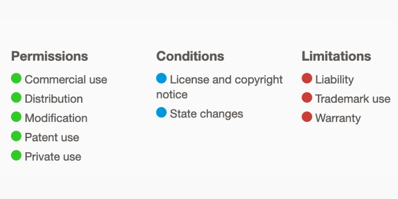

<div align="center">


<h1>Data Store for Decenwser</h1>

</div>

<br>

This program written to run on the Solana blockchain has the purpose of saving the respective HTML and JS data of each web page. The program is deactivated to date since this data architecture was no longer used in version 0.1.1. I'm now going show you the logic behind the program that stored information for Decenwser.

This program is the predecessor of the current program that runs behind Decenwser. However, the logic can be used by other projects focused on data distribution, not necessarily focused on web3. Specifically, in everything related to p2p data exchanges.

<h3 align="center">Init decenwser account 💻</h3>

<details>
<summary>Init decenwser account</summary>

```rust
pub fn decenwser(
    ctx: Context<Decenwser>
) -> Result<()> {
    // Find the program address based on the program ID and a fixed string.
    let (_pda, bump) = Pubkey::find_program_address(&[b"Decenwser"], ctx.program_id);
    let decenwser: &mut Account<DecenwserAccount> = &mut ctx.accounts.decenwser;
    // Set some fields of the DecenwserAccount.
    decenwser.pages_online = 0;
    decenwser.total_updates = 0;
    decenwser.bump_original = bump;
    Ok(()) // Return success.
}

#[derive(Accounts)]
pub struct Decenwser<'info> {
    // The DecenwserAccount being initialized.
    #[account(init, seeds = [b"Decenwser"], bump, payer = signer, space = DecenwserAccount::SIZE + 8)]
    pub decenwser: Account<'info, DecenwserAccount>,
    #[account(mut)] // The signer of the transaction.
    pub signer: Signer<'info>,
    // The system program, which provides basic program functionality.
    pub system_program: Program<'info, System>,
}
```

This function uses the derive macro to define a Decenwser structure that groups a series of accounts and programs necessary for the execution of the program. The Decenwser structure is defined by the #[derive(Accounts)] annotation, which means that the Accounts macro will automatically generate the code necessary to initialize and manipulate the accounts and programs associated with this structure.

The function starts by defining a tuple of two elements _pda and bump, which are generated using the find_program_address function of the solana_program::pubkey::Pubkey library. This pair of values ​​is used to initialize the decenwser account, which is defined as a mutable account in the Decenwser structure.

The decenwser account is initialized with the annotation #[account(init, seeds = [b"Decenwser"], bump, payer = signer, space = DecenwserAccount::SIZE + 8)]. This annotation indicates that a new account must be initialized in the Solana blockchain with the following parameters:

 - init: indicates that the account must be created if it does not exist.
seeds – This is a list of bytes used to generate a unique public key for the account. In this case, the seed is [b"Decenwser"].

- bump: it is a value of type u8 that is used to avoid collisions in the generation of the public key of the account.

- payer: indicates the account that will pay for the creation of the decenwser account. In this case, the signer account that is defined in the Decenwser.

- space: is the amount of space that is reserved on the blockchain for the decenwser account. In this case, the size of DecenwserAccount plus 8 bytes.

The signer account is defined as an account of type Signer, which is used to authenticate the transaction that modifies the decenwser account. Lastly, the Decenwser framework also includes a system program system_program, which is used to perform transactions on the Solana blockchain.

The decenwser function updates the fields of the decenwser account. In particular, it sets pages_online and total_updates to 0, and assigns the value of bump to bump_original. Finally, the function returns Ok(()), indicating that the update of the decenwser account was completed without errors.

</details>

<h3 align="center">Init Main Account 📡</h3>

<details>
<summary>Init main account</summary>

```rust
pub fn main_account(
    ctx: Context<MainAccountStruct>,
    web_name: String
) -> Result<()> {
    // Check if the web_name is within the allowed length.
    require!(web_name.len() <= 32, ErrorCode::TooLong);
    let main_account: &mut Account<MainAccount> = &mut ctx.accounts.main_account;
    // Generate a program derived address and bump value from the web_name.
    let (_pda, bump) = Pubkey::find_program_address(&[
        &anchor_lang::solana_program::hash::hash(web_name.as_bytes()).to_bytes()
        ],
        ctx.program_id
    );
    main_account.bump_original = bump;
    main_account.web_name = web_name;
    main_account.authority = ctx.accounts.signer.key();
    // Set the html, css and js fields of the main account to empty arrays.
    main_account.html = [].to_vec();
    main_account.css = [].to_vec();
    main_account.js = [].to_vec();
    main_account.len = 107;
    Ok(())
}

#[derive(Accounts)]
#[instruction(web_name: String)]
pub struct MainAccountStruct<'info> {
    // Define the main account as an initialized account with the given seeds, bump, payer and space.
    #[account(init, seeds = [
        &anchor_lang::solana_program::hash::hash(web_name.as_bytes()).to_bytes()],
        bump,
        payer = signer,
        space = MainAccount::SIZE + 8
    )]
    pub main_account: Account<'info, MainAccount>,
    // Define a mutable reference to the signer account.
    #[account(mut)]
    pub signer: Signer<'info>,
    // Define a reference to the System program account.
    pub system_program: Program<'info, System>,
}
```

The function takes two parameters as input: The first parameter is a ctx context object of type MainAccountStruct, which contains information about the transaction in which the function is being executed. The second parameter is a text string called web_name, which represents the name of the website to store in the main account.

The function first checks that the length of web_name is not greater than 32 characters. It then uses the find_program_address function from Solana's Pubkey library to calculate a unique address for the main account. The unique address is used to initialize the main account on the Solana blockchain using the main_account object in the MainAccountStruct structure.

The MainAccountStruct structure is defined using a #[derive(Accounts)] macro attribute, which indicates that the fields in the structure are Solana accounts. The main account main_account is initialized with a seed generated from the unique address calculated above, and space is reserved on the Solana blockchain using the space attribute.

The function also assigns default values ​​to some of the main account fields main_account. The main account stores website information, and the html, css, and js fields are used to store the HTML, CSS, and JavaScript source code, respectively. The len field is used to keep track of the total length of the website information stored in the main account.

Finally, the function returns Ok(()), indicating that the function execution completed successfully.

</details>

<h3 align="center">Add css store 🎨</h3>

<details>
<summary>Add css store</summary>

```rust
pub fn css_store(
    ctx: Context<CssStore>,
    css: String,
) -> Result<()> {
    // Ensure that the authority key of `main_account` matches the signer key, otherwise return an error.
    require!(ctx.accounts.main_account.authority.key() == ctx.accounts.signer.key(), ErrorCode::AuthorityError);
    let css_store: &mut Account<CSS> = &mut ctx.accounts.css_store;
    // Ensure that the length of `main_account` does not exceed the maximum allowed length.
    require!(8 + ctx.accounts.main_account.len < 9995, ErrorCode::TooLong);
    let main_account: &mut Account<MainAccount> = &mut ctx.accounts.main_account;
    css_store.css = css;
    // Push the current `total_updates` value of `decenwser` to the `css` field of `main_account`.
    main_account.css.push(ctx.accounts.decenwser.total_updates);
    let decenwser: &mut Account<DecenwserAccount> = &mut ctx.accounts.decenwser;
    decenwser.total_updates += 1;
    main_account.len += 8;
    Ok(())
}

#[derive(Accounts)]
pub struct CssStore<'info> {
    #[account(
        mut,
        seeds = [&anchor_lang::solana_program::hash::hash(main_account.web_name.as_bytes()).to_bytes()],
        bump = main_account.bump_original,
        realloc = 8 + main_account.len as usize + 8, // Resize account to fit data and padding
        realloc::payer = signer, // Charge resize to `signer` account
        realloc::zero = false, // Don't zero out unused space in the account
    )]
    pub main_account: Account<'info, MainAccount>,
    #[account(mut,seeds = [b"Decenwser"],bump = decenwser.bump_original)]
    pub decenwser: Account<'info, DecenwserAccount>,
    #[account(init, seeds = [&decenwser.total_updates.to_le_bytes()], bump, payer = signer, space = CSS::SIZE + 8)]
    pub css_store: Account<'info, CSS>,
    // Define the `signer` field, which is a signer that provides permission to modify the account.
    #[account(mut)]
    pub signer: Signer<'info>,
    // Define the `system_program` field, which is a reference to the Solana system program
    pub system_program: Program<'info, System>,
}
```

The function is used to store a CSS text string in a CSSStore account on the Solana blockchain. The CSSStore account is initialized in the CssStore data structure declaration and is defined with the #[account(init)] attribute. The account is created in the call to this function if it does not exist and is used to store the CSS code.

The function performs the following tasks:

- Verify that the signer's signature is equal to the main_account's authority key using the require! with a boolean expression that evaluates to true.

- Check that the account size main_account is less than 9995 bytes using the require! with a boolean expression that evaluates to true.

- Updates the css value in the css_store account to the CSS text string provided in the input.

- Add the value of total_updates from the decenwser account to the main_account css list.

- Increase the value of total_updates on the decenwser account.

- Increase the value of len in the main_account by 8.

- Returns an Ok(()) value if all previous tasks were executed successfully.

</details>

<h3 align="center"> Add html store</h3>

```rust
pub fn html_store(
    ctx: Context<HtmlStore>,
    html: String,
) -> Result<()> {
    require!(
        ctx.accounts.main_account.authority.key() == ctx.accounts.signer.key(),
        ErrorCode::AuthorityError
    ); // Checks if the main account's authority key matches the signer's key
    let html_store: &mut Account<HTML> = &mut ctx.accounts.html_store;
    require!(
        8 + ctx.accounts.main_account.len < 9995,
        ErrorCode::TooLong
    ); // Checks if storing the HTML would exceed the maximum length
    let main_account: &mut Account<MainAccount> = &mut ctx.accounts.main_account;
    html_store.html = html; // Stores the HTML string in the HtmlStore account
    main_account.html.push(ctx.accounts.decenwser.total_updates);
    let decenwser: &mut Account<DecenwserAccount> = &mut ctx.accounts.decenwser;
    decenwser.total_updates += 1; // Increments the total number of updates in the Decenwser account
    main_account.len += 8; // Increments the main account's length by 8 bytes
    Ok(())
}

// This code is using the `Accounts` procedural macro to define a struct named `HtmlStore`.
// The struct has four public fields, all of which are accounts:
#[derive(Accounts)]
pub struct HtmlStore<'info> {
    pub main_account: Account<'info, MainAccount>,
    pub decenwser: Account<'info, DecenwserAccount>,
    pub html_store: Account<'info, HTML>,
    pub signer: Signer<'info>,
    pub system_program: Program<'info, System>,
}
```
The html_store function takes two arguments: ctx is a Context object containing information about the transaction, and html is the fragment of HTML that you want to store.

The function first verifies that the signer of the transaction is the proper authority to modify the main_account. If it is not, it returns an ErrorCode::AuthorityError.

Then, it checks that the length of the HTML fragment is less than 9987 bytes (9995 bytes minus the 8 bytes needed for the main_account.len counter). If it is not, it returns an ErrorCode::TooLong error.

The function then updates the html_store account with the new HTML snippet and updates the total_updates counter in the decenwser account. It also updates the account main_account to add an entry to the update log and update the length of the content.

Finally, the function returns a successful result Ok(()).

<h3 align="center"> Add javascript store</h3>

```rust
pub fn js_store(
    ctx: Context<JsStore>,
    js: String,
) -> Result<()> {
    require!(ctx.accounts.main_account.authority.key() == ctx.accounts.signer.key(), ErrorCode::AuthorityError);
    let js_store: &mut Account<JS> = &mut ctx.accounts.js_store;
    require!(8 + ctx.accounts.main_account.len < 9995, ErrorCode::TooLong);
    let main_account: &mut Account<MainAccount> = &mut ctx.accounts.main_account;
    js_store.js = js;
    // Add the current total updates to the main account's JS array
    main_account.js.push(ctx.accounts.decenwser.total_updates);
    let decenwser: &mut Account<DecenwserAccount> = &mut ctx.accounts.decenwser;
    // Increment the total updates in the Decenwser account
    decenwser.total_updates += 1;
    // Increase the main account length by 8 bytes
    main_account.len += 8;
    Ok(())
}

#[derive(Accounts)]
pub struct JsStore<'info> {
    #[account(
        mut,
        seeds = [&anchor_lang::solana_program::hash::hash(main_account.web_name.as_bytes()).to_bytes()],
        bump = main_account.bump_original,
        // Reallocate the main account with extra space for the new JS string and array element
        realloc = 8 + main_account.len as usize + 8,
        // Use the signer account to pay for the reallocation
        realloc::payer = signer,
        // Don't zero out the reallocated space
        realloc::zero = false,
    )]
    pub main_account: Account<'info, MainAccount>,
    #[account(mut,seeds = [b"Decenwser"],bump = decenwser.bump_original)]
    pub decenwser: Account<'info, DecenwserAccount>,
    // Initialize a new JS account with space for the JS string and array element
    #[account(init, seeds = [&decenwser.total_updates.to_le_bytes()], bump, payer = signer, space = JS::SIZE + 8)]
    pub js_store: Account<'info, JS>,
    #[account(mut)]
    pub signer: Signer<'info>,
    pub system_program: Program<'info, System>,
}
```

The "js_store" function takes two arguments: the first is a "Context" object that contains information about the current state of the transaction and the resources needed to execute the function. The second is a "js" string that represents the JavaScript code to be stored in a Solana account.

The function performs the following tasks:
Verify that the account of the owner of the main account is the same as the account of the signer of the transaction. If they are not equal, the function returns an error. Checks that the length of the parent account string plus 8 is not greater than 9995. If so, the function returns an error. Gets a mutable reference to the "js_store" account and stores the JavaScript in it. Gets a mutable reference to account "main_account" and adds the total number of updates to the list of updates. Gets a mutable reference to the "decenwser" account and increases the total number of updates. Increase the length of the "main_account" account by 8.

Finally, returns a success value if all operations completed successfully.

<h3 align="center">License📜</h3>

This project is licensed under the Apache License, Version 2.0 (the "License"). You may not use this file except in compliance with the License. You may obtain a copy of the License at:

http://www.apache.org/licenses/LICENSE-2.0

Unless required by applicable law or agreed to in writing, software distributed under the License is distributed on an "AS IS" BASIS, WITHOUT WARRANTIES OR CONDITIONS OF ANY KIND, either express or implied. See the License for the specific language governing permissions and limitations under the License.

<div align="center">



</div>
